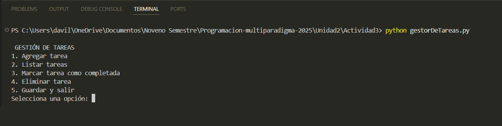
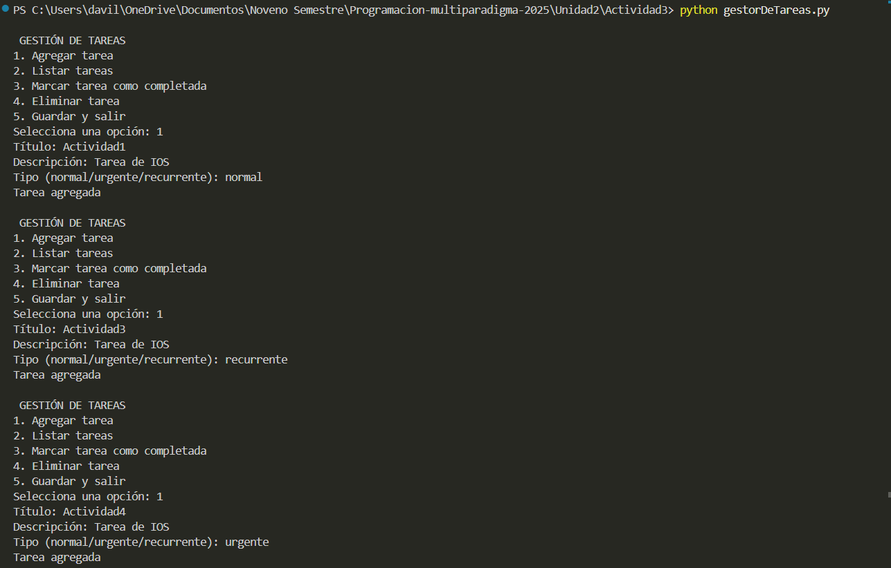
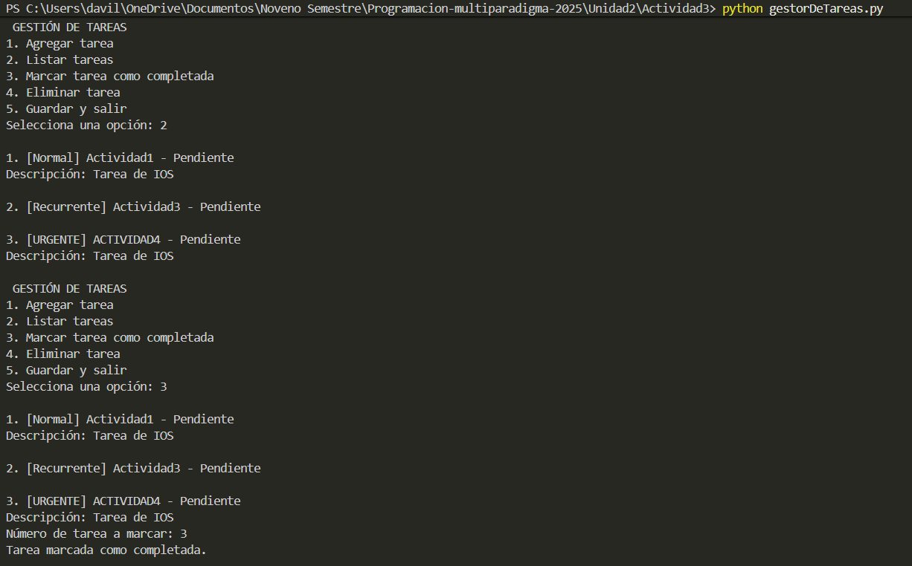
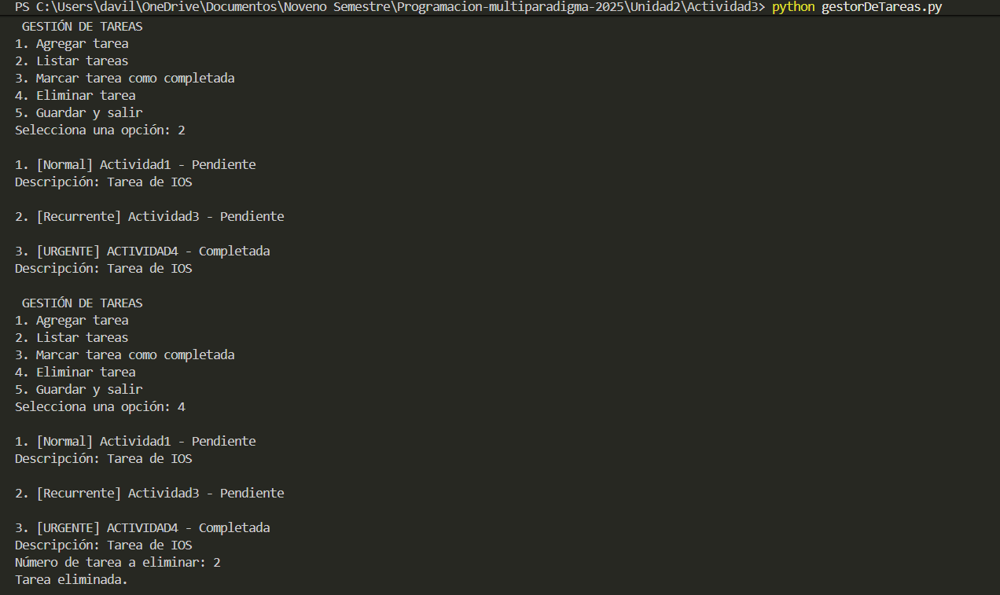
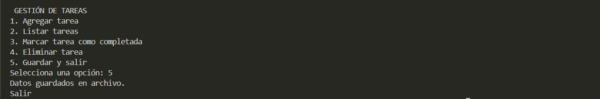
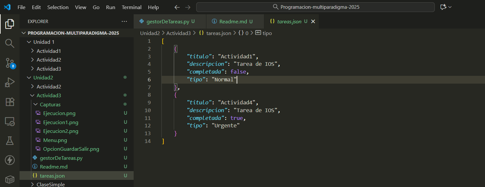

# Sistema de Gestión de Tareas

## Autora:
#### Eunice Ramona Dávila Lugo

## Objetivo del proyecto
Aplicar los principios de la programación orientada a objetos para desarrollar un sistema que gestione tareas personales, utilizando clases, objetos, herencia, encapsulación y polimorfismo en Python.

El propósito es que el estudiante consolide los fundamentos de la POO diseñando un programa funcional y organizado, que modele entidades del mundo real con claridad y buena práctica de diseño.

## Funcionalidades del sistema

- Agregar nuevas tareas
- Listar las tareas registradas
- Marcar tareas como completadas
- Eliminar tareas
- Guardar y cargar las tareas en un archivo JSON
- Salir del programa desde el menú en consola

## Diseño basado en Programación Orientada a Objetos

### 1. Clases y Objetos
Se crean clases que representan entidades reales.

- *Tarea*: modelo principal de una tarea.
- *TareaUrgente* y *TareaRecurrente*: tipos especiales de tareas.
- *GestorTareas*: administrador que gestiona varias tareas.

Cada tarea que el usuario crea se convierte en un objeto.

### 2. Encapsulación
Los atributos de la clase *Tarea* se declaran como privados con guion bajo (**_titulo**, **_descripcion**, etc.) y se acceden mediante métodos y propiedades **@property**.

Esto protege los datos evitando que se modifiquen directamente desde fuera.

### 3. Herencia
Las clases *TareaUrgente* y *TareaRecurrente* **heredan** de la clase *Tarea*

Esto permite reutilizar atributos y métodos de la clase base sin volver a escribir código.

### 4. Polimorfismo

Las clases hijas redefinen el método *mostrar_info()* para mostrar la información de manera diferente según el tipo de tarea.  

El gestor llama al mismo método, pero el comportamiento cambia dependiendo del tipo del objeto.

### 5. Persistencia de Datos

El programa guarda las tareas en un archivo **tareas.json**, utilizando un método que convierte el objeto a diccionario antes de almacenarlo.

### Ejecución del programa

En una terminal, dentro de la carpeta del proyecto, ejecutar:  
**python gestorDeTareas.py**

### Evidencias de ejecucion en la terminal 

#### Menú

#### Ejemplo de ejecución

#### Opción salir y guardar 

#### Evidencia del archivo JSON
