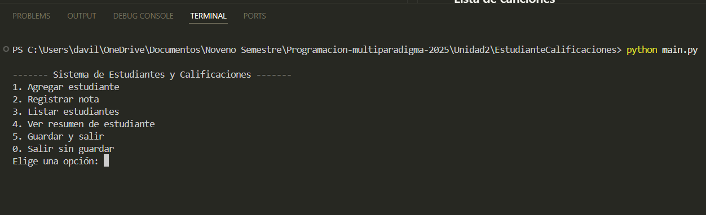
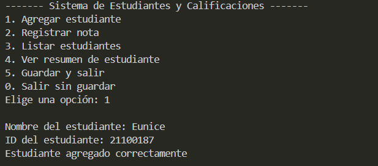
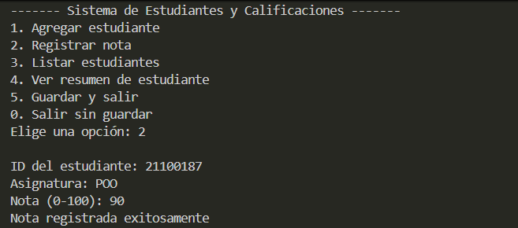
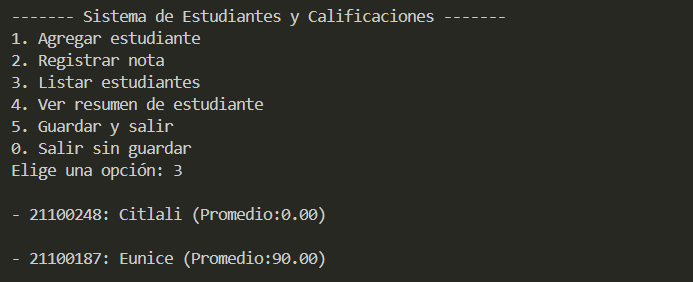
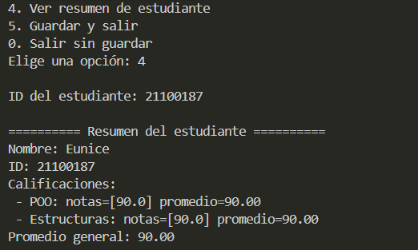
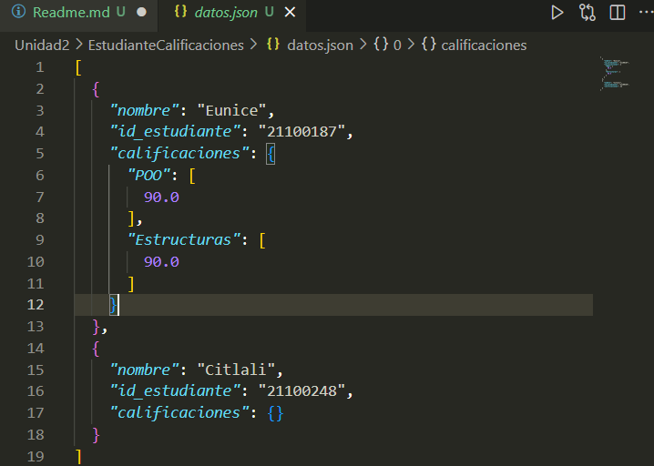

# Sistema de Gestión de Estudiantes y Calificaciones

### Autor: Eunice Ramona Dávila Lugo

## Objetivo
El objetivo de mi proyecto es crear un sistema modular en Python que permita **gestionar estudiantes y sus calificaciones**. 
El sistema permite **agregar estudiantes, registrar notas, ver promedios y guardar la información** en un archivo JSON para su posterior uso.

## Estructura del Proyecto
├── modelos.py # Define la clase Estudiante y sus atributos  
├── operaciones.py # Contiene la clase GestorEstudiantes y sus funciones  
├── main.py # Interfaz por consola para interactuar con el usuario  
└── datos.json # Archivo donde se guardan los datos (creado automáticamente)  

##  Funcionalidades Principales
- Agregar estudiantes con nombre e ID.  
- Registrar calificaciones por asignatura.  
- Calcular el promedio general de cada estudiante.  
- Listar todos los estudiantes con sus promedios.  
- Guardar y cargar los datos desde un archivo JSON.

## Ejecución
Para ejecutar el programa se utiliza el siguiente comando en la terminal:  
### python main.py  

## Evidencias del funcionamiento

### Menú principal
 

### Agregar Estudiante 
 

### Registrar nota de un estudiante
 

### Lista de los estudiantes
 

### Ver resumen de un estudiante
 

### Archivo JSON con los datos guardados
 