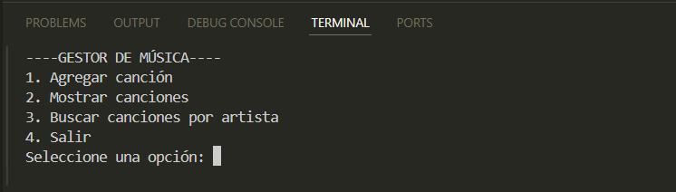
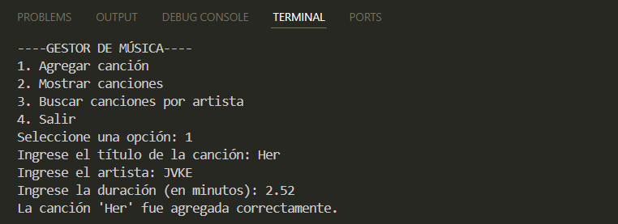
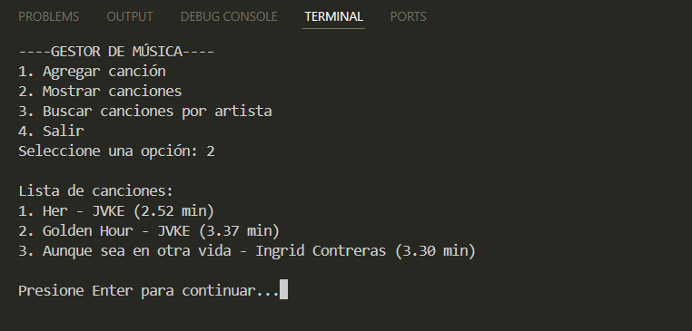
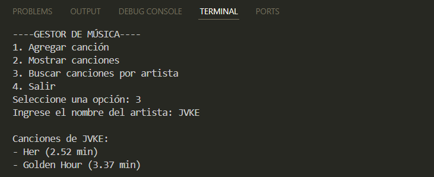

# Manual de Usuario - Gestor de Música

## Propósito del programa
El proyecto fue desarrollado con el objetivo de crear un pequeño sistema que gestione canciones desde la línea de comandos.  
El programa permite al usuario agregar nuevas canciones, mostrar la lista completa y buscar canciones por artista.

## Estructura del proyecto
El proyecto está dividido en módulos para mantener la organización y la legibilidad del código:

- **main.py:** archivo principal que controla el flujo del programa y muestra el menú de opciones al usuario.
- **modulos/modelo.py:** contiene las clases **Cancion** y **GestorMusica**, responsables de manejar los datos y las operaciones principales.
- **modulos/utilidades.py:** incluye funciones auxiliares como limpiar la pantalla y mostrar el menú principal.
- **docs/manual_usuario.md:** documento que explica el propósito del sistema, su estructura y cómo ejecutarlo.

## Cómo ejecutar el proyecto
1. Abrir una terminal o Visual Studio Code en la carpeta del proyecto.
2. Ejecutar el siguiente comando:

   ```bash
   python main.py
3. Seleccionar una opción del menú:

- 1: Agregar una nueva canción.

- 2: Mostrar todas las canciones.

- 3: Buscar canciones por artista.

- 4: Salir del sistema.

## Ejemplo de ejecución
=== GESTOR DE MÚSICA ===
1. Agregar canción
2. Mostrar canciones
3. Buscar canciones por artista
4. Salir  

Seleccione una opción: 1  
Ingrese el título de la canción: Shape of You  
Ingrese el artista: Ed Sheeran  
Ingrese la duración (en minutos): 4.2  
La canción 'Shape of You' fue agregada correctamente

## Evidencias del funcionamiento

### Menú principal


### Canción agregada


### Lista de canciones


### Buscar por artista
